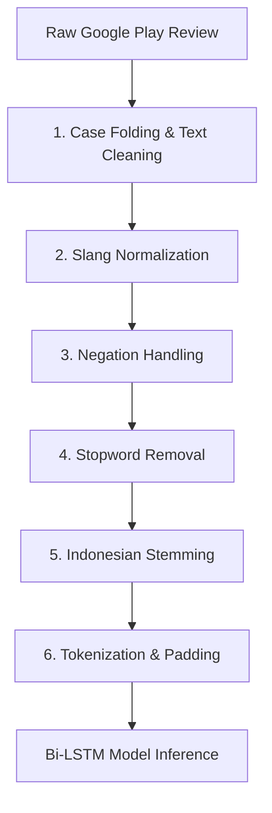
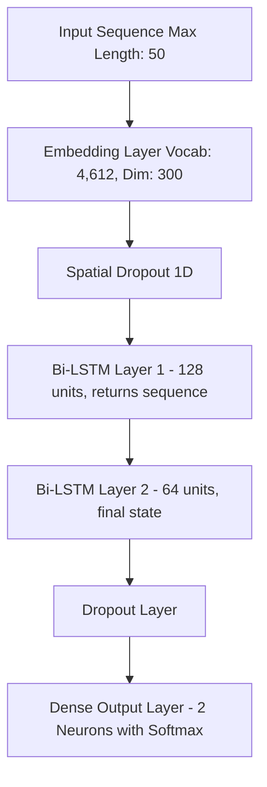

# 🧠 Tangerang Live Sentiment Analysis: End-to-End NLP & Deep Learning System

[](https://www.python.org/)
[](https://tensorflow.org/)
[](https://keras.io/)
[](https://streamlit.io/)
[](https://en.wikipedia.org/wiki/Natural_language_processing)

An end-to-end data science and deep learning system built to collect, preprocess, analyze, and visualize public sentiment regarding the **Tangerang Live** mobile application (the official public service app for Tangerang City, Indonesia).

This project features a custom-built **Indonesian NLP preprocessing pipeline**, a **Bidirectional LSTM (Bi-LSTM)** neural network built using Keras/TensorFlow, and an interactive **Streamlit dashboard** for real-time text analysis, batch visualizations, and live Google Play Store scraping.

---

## 📌 Project Overview & Business Value

For public service apps like **Tangerang Live**, monitoring public feedback is crucial for continuous improvement. However, manually analyzing thousands of Google Play Store reviews is resource-intensive and subjective. 

This repository provides an automated **data-driven solution**:
- **Automated Data Scraping**: Live scraping of reviews from the Google Play Store.
- **Robust NLP Pipeline**: Custom text normalization handling Indonesian slang, abbreviations, and complex negation terms (e.g., `tidak_membantu`).
- **Deep Learning Classifier**: A Bi-LSTM network trained on FastText embeddings to automatically classify reviews into **Positive** or **Negative** sentiments.
- **Decision-Support Dashboard**: An interactive, glassmorphism-styled dark UI that allows decision-makers to track user satisfaction trends, view recurring keywords (Word Clouds), and run real-time predictions.

---

## 🛠️ Data Science & NLP Pipeline

Indonesian social media and review text are heavily laden with informal terms, typos, and slang. To combat this, the pipeline implements a rigorous multi-stage preprocessing workflow:



### Detailed Preprocessing Stages
1. **Case Folding & Cleaning**: Converts text to lowercase, removes URLs, numbers, emojis, and punctuation.
2. **Slang Normalization**: Maps informal words, typos, and abbreviations to their standard Indonesian equivalents (e.g., `yg` $\rightarrow$ `yang`, `ga` $\rightarrow$ `tidak`, `error` $\rightarrow$ `eror`) using a mapped dictionary ([`slang.csv`](file:///c:/All/Coolyeah/Semester%208/Crispy/Program%20Analisis/web/slang.csv)).
3. **Negation Handling**: A critical step for sentiment analysis. Standard stopword removers often delete negations (like `tidak`, `kurang`, `belum`), destroying the sentiment. This module pairs negations with the word that follows them (e.g., `tidak puas` $\rightarrow$ `tidak_puas`), preserving context.
4. **Stopword Removal**: Eliminates low-value words based on Sastrawi and NLTK Indonesian stopword corpora, while ensuring negation-compounded terms remain intact.
5. **Indonesian Stemming**: Utilizes the `Sastrawi` library to reduce words to their root forms (e.g., `membantu` $\rightarrow$ `bantu`). It also correctly stems parts of negation-joined phrases (e.g., `tidak_membantu` $\rightarrow$ `tidak_bantu`).
6. **Tokenization & Padding**: Converts text tokens to integer sequences using a pre-configured word index and pads/truncates them to a fixed sequence length of **50 words**.

---

## 🧠 Model Architecture & Deep Learning Details

The deep learning model is built using a **Sequential Bi-LSTM** structure. Bi-LSTMs are highly effective for sentiment analysis as they capture context from both left-to-right and right-to-left directions, which is essential for understanding conditional clauses or sarcasm in reviews.



### Model Layer Breakdown (from Keras `model.summary()`)
* **Embedding Layer**: Projects input tokens into a 300-dimensional vector space using pretrained FastText vectors.
* **Spatial Dropout 1D**: Dropping entire 1D feature maps to prevent co-adaptation of features.
* **Bidirectional LSTM (Layer 1)**: Returns sequences with an output shape of `(None, 50, 128)` (64 units in forward and backward directions).
* **Bidirectional LSTM (Layer 2)**: Outputs the final hidden state of `(None, 64)` (32 units in forward and backward directions).
* **Dense Output Layer**: Softmax classifier producing probability scores for the 2 classes (Negative at index 0, Positive at index 1).

### Parameters Summary
| Layer Type | Output Shape | Parameters |
| :--- | :--- | :--- |
| **Embedding** | `(None, 50, 300)` | 1,383,900 |
| **Spatial Dropout 1D** | `(None, 50, 300)` | 0 |
| **Bidirectional LSTM 1** | `(None, 50, 128)` | 186,880 |
| **Bidirectional LSTM 2** | `(None, 64)` | 41,216 |
| **Dropout** | `(None, 64)` | 0 |
| **Dense (Softmax)** | `(None, 2)` | 130 |
| **Total Trainable Params**| **1,612,126 (6.15 MB)**| |

---

## 📊 Streamlit Dashboard Features

The dashboard application ([`app.py`](file:///c:/All/Coolyeah/Semester%208/Crispy/Program%20Analisis/web/app.py)) provides a premium, responsive dark UI containing three main analytical modules:

1. **📝 Single Text Analysis**: 
   - Enter any custom review in Indonesian.
   - Outputs the predicted sentiment (Positive/Negative) with a confidence percentage.
   - Shows probability distribution graphs and text statistics.
2. **📊 Batch Dashboard**:
   - Visualizes the dataset (`hasil_review_Tangerang_Live.csv`) containing 7,112 reviews.
   - Interactive Plotly visualizations (pie charts of sentiment distribution, ratings breakdowns, and time-series trends).
   - Sentiment-specific Word Clouds highlighting frequently used words in positive vs. negative reviews.
3. **📥 Play Store Scraper**:
   - Scraping module powered by `google-play-scraper`.
   - Pulls live reviews for any Android application by entering its App ID (e.g., `com.tangerangkab.tangeranglive`).
   - Runs model predictions on the scraped data in real-time, allowing instant dashboard updates.

---

## 📂 Repository Structure

```directory
├── model_tangerang_live_biner.keras    # Pre-trained Bi-LSTM model (approx. 19 MB)
├── tokenizer (14).json                # Saved tokenizer vocabulary configuration
├── app.py                             # Main Streamlit dashboard application
├── slang.csv                          # Indonesian slang normalization dictionary
├── hasil_review_Tangerang_Live.csv    # Primary dataset (7,112 scraped reviews)
├── positive.tsv                       # Positive sentiment lexicon
├── negative.tsv                       # Negative sentiment lexicon
├── Scraper_From_GooglePlay.ipynb      # Notebook detailing the review scraping pipeline
├── analytic-sentiment-tangerang-live.ipynb # Model training & evaluation notebook
├── setup.py                           # System environment installer & dependency resolver
├── check_installation.py              # Debugging helper for library checking
└── requirement.txt                    # Project dependencies list
```

---

## 🚀 Getting Started

To run the application locally on your machine, follow these instructions:

### Prerequisites
- Python 3.9, 3.10, or 3.11 is recommended.
- Git installed.

### 1. Clone the Repository
```bash
git clone https://github.com/YotaGod/tangerang-live-sentiment-analysis.git
cd tangerang-live-sentiment-analysis
```

### 2. Setup Virtual Environment (Recommended)
```bash
python -m venv venv
# On Windows
venv\Scripts\activate
# On macOS/Linux
source venv/bin/activate
```

### 3. Install Dependencies
You can use the automated script [`setup.py`](file:///c:/All/Coolyeah/Semester%208/Crispy/Program%20Analisis/web/setup.py) to resolve packages, or install them manually:
```bash
pip install -r requirement.txt
```

### 4. Run the Streamlit App
Run the following command to start the local development server:
```bash
streamlit run app.py
```
The application will launch in your default web browser at `http://localhost:8501`.

---

## 🎓 Author & Portfolio

Developed as part of an academic thesis on NLP and Deep Learning application in public service evaluations.

* **Developer**: YotaGod
* **Email**: muh.ilhamrizalulfath02@gmail.com
* **GitHub**: [@YotaGod](https://github.com/YotaGod)
* **Specialization**: Data Science, Deep Learning, Natural Language Processing (NLP)
